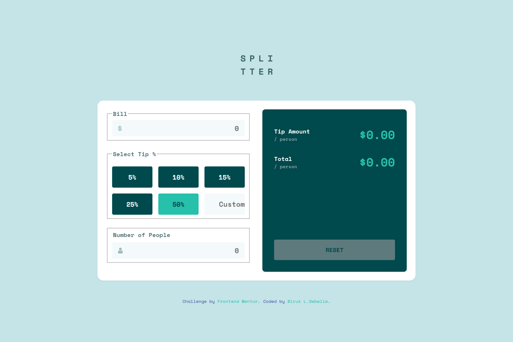

# Frontend Mentor - Tip Calculator App Solution

This is a solution to the [Tip Calculator App challenge on Frontend Mentor](https://www.frontendmentor.io/challenges/tip-calculator-app-ugJNGbJUX). Frontend Mentor challenges help you improve your coding skills by building realistic projects. 

## Table of contents

- [Overview](#overview)
  - [The challenge](#the-challenge)
  - [Screenshot](#screenshot)
  - [Links](#links)
- [My process](#my-process)
  - [Built with](#built-with)
  - [What I learned](#what-i-learned)
  - [Continued development](#continued-development)
  - [Useful resources](#useful-resources)
- [Author](#author)
- [Acknowledgments](#acknowledgments)

---

## Overview

### The challenge

Users should be able to:

- Enter the bill amount
- Select a tip percentage or enter a custom tip
- Enter the number of people sharing the bill
- See the tip amount and total per person
- View form validation messages if input is invalid (e.g., zero people)
- Reset the calculator to default state

### Screenshot

  

### Links

- Solution URL: [Fontend Mentor](https://www.frontendmentor.io/solutions/tip-calculator-app-4mF7THZW_Rs)
- Live Site URL: [Github Pages](https://birukl137.github.io/Tip-calculator-app/)

---

## My process

### Built with

- Semantic HTML5 markup
- CSS custom properties (design tokens)
- Flexbox & CSS Grid
- Mobile-first workflow
- Vanilla JavaScript (ES6+)
- Accessibility considerations (aria attributes, visually hidden text)

### What I learned

Working on this project helped me improve at:

- Structuring form inputs with validation messages inline
- Using `flexbox` to align legends and error messages side-by-side
- Handling real-time calculations in JavaScript while keeping code clean
- Improving accessibility with `aria-live` regions and `aria-pressed` for toggle buttons

Here’s a small code snippet I’m proud of:

```js
[billInput, peopleInput].forEach(input => {
  input.addEventListener("input", () => {
    const activeBtn = [...tipButtons].find(btn => btn.getAttribute("aria-pressed") === "true");
    if (activeBtn) {
      handleCalculation(parseFloat(activeBtn.dataset.tip));
    } else if (customTipInput.value) {
      handleCalculation(parseFloat(customTipInput.value));
    }
  });
});

```

### Continued development

In future projects, I want to focus more on:

 - Better error handling with smoother animations

 - Making the app fully keyboard accessible

 - Exploring localStorage to save the last state of the calculator

### Useful resources

 - [MDN Web Docs](https://developer.mozilla.org/) - For quick reference on JavaScript and accessibility.

 - [Frontend Mentor community](https://www.frontendmentor.io/community) - Helpful feedback and examples.


## Author

- Frontend Mentor - [@BirukL137](https://www.frontendmentor.io/profile/BirukL137)
- Github - [@BirukL137](https://github.com/BirukL137)


## Acknowledgments

Thanks to the Frontend Mentor community for code reviews and helpful feedback while building this project.

